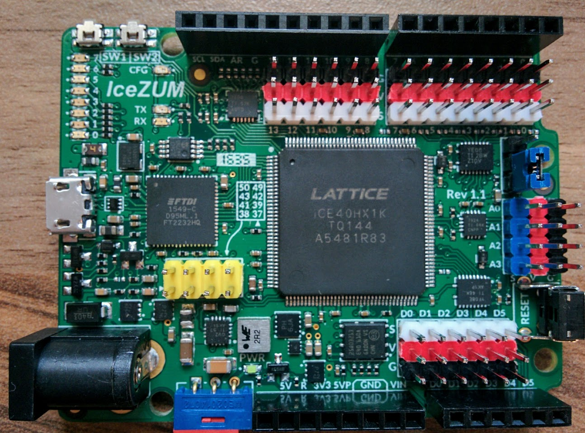
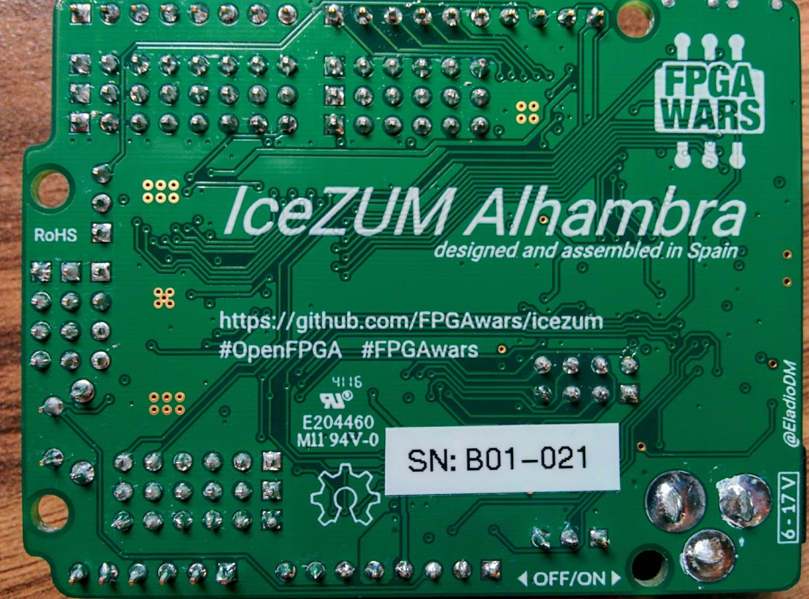
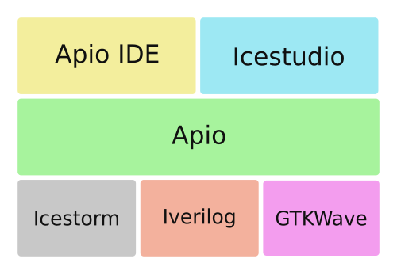

# Demo IceZum Alhambra

@javacasm para la OSL

29 de noviembre de 2016

## IceZum Alhambra

Es una placa totalmente [libre (Open Hardware)](https://github.com/FPGAwars/icezum) que incluye una FPGA en un formato totalmente compatible  con Arduino

## Orígenes

* Juan Gonzalez (Obijuan)
* Eladio Delgado: diseñador y constructor de la placa
* Jesús Arroyo: desarrollador del software

* En sus inicios fue un proyecto financiado por bq

([Historia](https://github.com/FPGAwars/icezum#history))

## ¿FPGA?

[Field Programmable Gate Array](https://es.m.wikipedia.org/wiki/Field_Programmable_Gate_Array)

### ¿Qué es una FPGA?

(Del [Capítulo 0 de Tutorial de @Obijuan sobre Verilog](https://github.com/Obijuan/open-fpga-verilog-tutorial/wiki/Cap%C3%ADtulo-0:-you-are-leaving-the-privative-sector))

"Las [FPGAs](https://es.wikipedia.org/wiki/Field_Programmable_Gate_Array) son unos chips "en blanco" que nos permiten configurarlos para crear dentro de ellos nuestros propios circuitos digitales. ¡Si! ¡Con las FPGAs estamos creando hardware!

Los circuitos se describen usando un **Lenguaje de Descripción de Hardware** (HDL) como Verilog o VHDL. A partir de ellos se genera un bitstream que describe las uniones entre los elementos usados.

Llamamos **síntesis** a todo el proceso que nos lleva desde el diseño en código fuente hasta la configuración de la FPGA. Estas son las fases:

**1 Síntesis**: La herramienta de síntesis infiere los elementos hardware básicos a partir de su descripción, y obtiene un fichero **netlist** que describe las uniones entre ellos. Esta fase no depende de la FPGA a usar

**2 Emplazado y rutado**. Los componentes del netlist se hacen corresponder con los elementos físicos de la FPGA, se determina su colocación y se realiza el rutado. Toda la información de configuración de la FPGA se condensa en el bitstream. Esta fase sí depende del modelo concreto de FPGA que se disponga

### ¿Para qué se utilizan las FPGAs?

Nos permiten sustituir a muchos circuitos digitales discretos necesarios en dispositivos.

[Apple usa FPGAs en su iPhone](http://www.fool.com/investing/2016/09/19/1-more-surprise-winner-inside-the-apple-inc-iphone.aspx) posiblemente para sustituir a docenas de componentes.

Podemos modificar el comportamiento de una FPGA cambiando su bitstream, por tanto podríamos resolver errores y aportar mejoras a un diseño hardware.

### Comparación con un procesador Von Newman

* Con una FPGA podemos crear un procesador donde configuremos la cantidad de RAM, la cantidad de I/O, número de UART, incluso modificarlos si es necesarios

* Piensa en un programa Arduino que reproduce un sonido. Ahora intenta hacer un programa que reproduzca 2 sonidos a la vez, o tres... con una FPGA basta con copiar+pegar el hardware

* Facilitan enórmemente la paralelización del hardware.

* Encoder para 1 rueda: programación vía interrupciones, necesitamos 2 entradas con interrupción. Si ahora necesitamos 4....

## "Las FPGAs son las impresoras 3D de los circuitos digitales"

### Un poco de historia

Hasta hace poco la única forma de trabajar con una FPGA era usando el sortware que proporcionaba el fabricante.

En **mayo de 2015** ocurrió un **hito histórico**: se tuvieron por primera vez todas las herramientas necesarias para **generar el bitstream** a partir de **código en Verilog** usando **sólo software libre**, gracias al [proyecto icestorm](http://www.clifford.at/icestorm/), liderado por **Clifford Wolf**.  A partir de ese momento,ya tenemos herramientas que pertenecen al **patrimonio tecnológico de la humanidad** para trabajar con FPGAs, y poder desarrollar hardware usando sólo herramientas de este patrimonio

Actualmente sólo se pueden usar las FPGAs de Lattice de la familia ICE40

### Las herramientas del proyecto Icestorm

Las herramientas libres para trabajar con las FPGAs de lattice son las siguientes:

**Sintetizador**: [Yosys](http://www.clifford.at/yosys/) ([Repo en github](https://github.com/cliffordwolf/yosys))
**Place & route**: [Arachne-pnr](https://github.com/cseed/arachne-pnr) (en github)
**Utilidades y descarga en FPGA**: [Proyecto icestorm](http://www.clifford.at/icestorm/)

En la siguiente figura se muestran las diferentes herramientas usadas en las etapas, y las extensiones de los archivos que se van generando:

Se parte de los ficheros **fuente en verilog** (.v). Usando el sintetizador **Yosys**, se generan los ficheros **netlist** (.blif). El emplazado y rutado se realiza con **arachne-pnr**, generándose el **bitstream en formato ascii** (.txt). Con **icepack** se crea el **bitstream binario** (.bin) que finalmente se envía a la FPGA con **iceprog**

## Descripción de la ICEZum Alhambra

* FPGA development board (iCE40HX1K-TQ144 from lattice)
* Open hardware
* Compatible with the opensource icestorm toolchain
* Arduino like board: similar pinout than Arduino one / BQ zum.
* You can Reuse most of available shields
* Control your robots / printbots from an FPGA
* 12 MHZ MEMS oscillator
* ON/OFF switch (turn off your mobile robot easily)
* Input power voltage: 6 - 17v
* Max input current: 3A (Perfect for powering your robots)
* 20 Input/output 5v pins
* 8 Input/Output 3.3V pins
* USB micro-B connector for programming the FPGA from the PC (same than zum board)
* FTDI 2232H USB device allows FPGA programming and UART interface to a PC
* Reset pushbutton
* 8 general purpose leds (user leds)
* 2 general purpose pushbuttons
* 4 analogue inputs though I2C bus

  [Pinout](https://github.com/FPGAwars/icezum/wiki#pinout)

  

### ¿Cómo funciona?

Las FPGAs pierden su configuración (bitstream) cada vez que se apagan.

Cuando escribimos el bitstream, este se almacena en una memoria ¿RAM flash? y desde ahí cada vez que se resetea se envía a la FPGA

## Placas
[Icezum Alhambra](https://github.com/FPGAwars/icezum)

[Nandland Go board](https://www.nandland.com/goboard/introduction.html)

[iCEstick Evaluation Kit](http://www.pighixxx.com/test/portfolio-items/icestick/)

[iCE40-HX8K Breakout Board](http://www.latticesemi.com/en/Products/DevelopmentBoardsAndKits/iCE40HX8KBreakoutBoard.aspx)

[icoBOARD 1.0](http://icoboard.org/about-icoboard.html)

[CAT Board](https://hackaday.io/project/7982-cat-board)

[Kéfir I](http://fpgalibre.sourceforge.net/Kefir/)

## Uso

### Herramientas

Podemos elegir entre usar Verilog o un diseño visual, entre usar heramientas de bajo nivel o trabajar a un nivel más alto.

#### [Apio](http://apiodoc.readthedocs.io/en/stable/source/installation.html)

Paquete python que utiliza las herramientas Icestorm

    sudo pip install -U apio

(instalación global, se puede hacer también local con virtualenv)

Apio incluye sus propios drivers del chip FTDI, necesarios para su buen funcionamiento.
Para activarlos

    sudo apio drivers --enable

Ahora instalamos la toolchain necesaria

    apio install -all

Ya lo tenemos listo para hacer cualquier operación

Creamos un nuevo proyecto:

    apio examples -d leds
    cd leds

Ahora creamos la configuración para nuestra placa

    apio init --board icezum

Comprobamos que el proyecto está ok

    apio verify

Si tenemos instalado algún simulador (GTKWave)

    apio sim

Cuando estemos conformes con el resultado, sintetizamos el bitstream

    apio build

Y lo enviamos a la placa con

    apio upload

#### [Apio IDE](https://github.com/FPGAwars/apio-ide/wiki)

Se trata de un paquete de Atom que permite integrar Apio en PlatformIDE

Una vez instalado Apio, instalamos Atom

Después instalamos el paquete Apio-ide que configuramos para que encuentre a Apio

#### [ICEStudio](https://github.com/FPGAwars/icestudio)

Descargarmos la [última release](https://github.com/FPGAwars/icestudio/releases)

##### [Ejemplos](https://github.com/Obijuan/myslides/tree/master/2016-11-18-Maker-faire-Bilbao-FPGAs-libres/demos)

### Ejemplos

* [Ejemplos de iceZum](https://github.com/FPGAwars/icezum/tree/master/examples)

* [Procesador simplez](https://github.com/Obijuan/simplez-fpga)

* [Procesador ACC (procesador de las naves Apolo, sí las de la Luna)](https://github.com/Obijuan/ACC)

* [Periféricos](https://github.com/FPGAwars/FPGA-peripherals)

* [Ejemplos de IceZum Studio](https://github.com/FPGAwars/icestudio-examples)

* Cómo migrar un ejemplo entre placas

* Creando bloques

### Instalación

## Placas disponibles

## Mucho trabajo por hacer

* Mejora del software
* Optimización en MS Windows
* Implementación hardware de un periferico I2C
* Implementación del protocolo I2C para el ADC
* Implementación de bloques generales

## Recursos

* [Lista de correo: FPGAWars explorando el lado libre](https://groups.google.com/forum/#!forum/fpga-wars-explorando-el-lado-libre)
Preséntate y si quieres puedes pedir una Alhambra
Ahora mismo se está entregando la 1a tirada de 110 placas y hay una lista de espera (con casi 80 apuntados) para una segunda tirada

* [Organización de Github FPGAWars](https://github.com/FPGAwars)
Puedes ver los proyectos actuales y la documentación sobre las [charlas](https://github.com/FPGAwars/workshops)

* [Wiki de la IceZum Alhambra](https://github.com/FPGAwars/icezum/wiki)

* [Tutorial de Verilog de @Obijuan](https://github.com/Obijuan/open-fpga-verilog-tutorial/wiki)

* [Presentaciones de Obijuan sobre FPGAs](https://github.com/Obijuan/myslides)

* [OSHWDem 2016: Charla FPGAs Libres - Juan González ( Obijuan ](https://www.youtube.com/watch?v=XWC1B7UKv98)

* [Juan Gonzalez Obijuan FPGAWars Explorando el lado libre de las FPGAs](https://www.youtube.com/watch?v=rdlEpW_Ce5g)

* [Vídeos sobre FPGAs de @Obijuan](https://www.youtube.com/user/obijuancube/videos)

* [Definición Verilog de CI TTL](https://github.com/taw/ttl-cpu/tree/master/verilog)

## Limitaciones

¿Hay un número máximo de reescrituras?: [La limitación está en el número máximo de reescrituras de la memoria que se usa](http://digital.ni.com/public.nsf/allkb/91DE0C3B7740C287862574D300646369)

## Dudas

¿configuración de accesso rápido por  teclado de iceStudio?

¿Configuración Pull up?

¿Cómo se crean losbloques?
